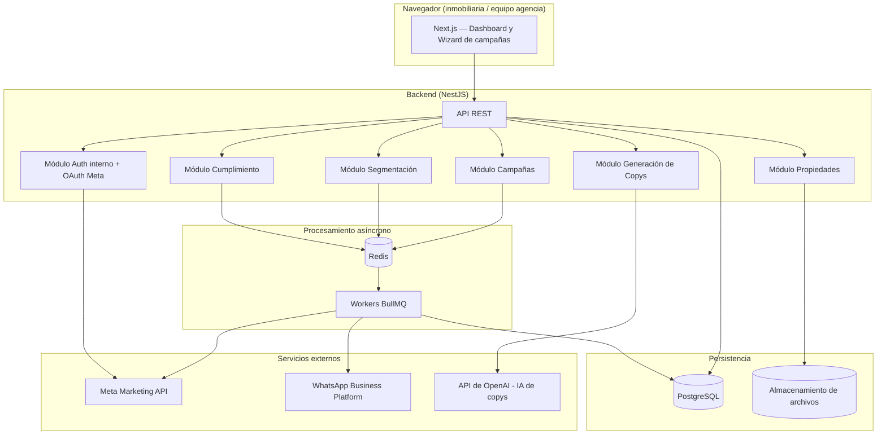

# Arquitectura técnica — App de Gestión de Campañas Meta Ads para Inmobiliarias (Chile)

**Módulo:** M0 — Descubrimiento y arquitectura técnica
**Estado:** Propuesta para revisión de Paul
**Versión:** 1.0 — 11 de agosto de 2026

Este documento define el stack tecnológico y la arquitectura sobre la que se construirán los módulos M1–M13 del plan de trabajo. Es una propuesta: donde haya una decisión con alternativas razonables, se explica el porqué para que puedas ajustarla si tienes una preferencia distinta (por ejemplo, si ya usan cierto proveedor cloud en la empresa).

---

## 1. Objetivos de la arquitectura

- Operar de forma confiable contra la Marketing API de Meta, que tiene límites de uso (rate limiting) y llamadas que pueden fallar o demorar — se necesita procesamiento asíncrono, no solo request/response directo.
- Soportar múltiples inmobiliarias (multi-tenant) de forma aislada y segura, cada una con su propia cuenta publicitaria conectada.
- Guardar credenciales/tokens de Meta y datos de leads de forma cifrada y auditable (relevante para Ley 21.719 de protección de datos).
- Permitir agregar generación de copys con IA y validaciones de cumplimiento sin acoplar todo en un solo servicio monolítico difícil de mantener.
- Poder escalar por cliente (más inmobiliarias, más campañas) sin rediseñar la base.

## 2. Stack tecnológico propuesto

| Capa | Elección | Por qué |
|---|---|---|
| Frontend | **Next.js 14+ (TypeScript, App Router) + Tailwind + shadcn/ui** | Un solo framework para el dashboard y el wizard de campañas, buen soporte de formularios complejos (el wizard de creación de campaña tiene varios pasos condicionales), renderizado rápido, ecosistema maduro. |
| Backend / API | **NestJS (Node.js, TypeScript)** | Estructura modular (cada módulo del plan —auth, campañas, segmentación, copys, cumplimiento— puede vivir como un módulo de NestJS separado), buen soporte para colas, guardas de autorización y testing. Mismo lenguaje que el frontend (TypeScript en todo el stack), lo que reduce fricción de equipo. |
| Procesos en segundo plano | **BullMQ sobre Redis** | Todas las llamadas a la Marketing API (crear campaña, publicar, sincronizar estado, leer resultados) pasan por colas con reintento y backoff, en vez de llamarse en línea desde el request del usuario. Esto es clave porque la API de Meta limita por Business Use Case y puede devolver 429. |
| Base de datos | **PostgreSQL 16 + Prisma ORM** | Relacional, con buen soporte de transacciones (importante para no dejar campañas a medio crear) y de Row-Level Security para aislar datos por inmobiliaria. Prisma da tipado end-to-end con TypeScript. |
| Multi-tenancy | **Esquema compartido, aislado por `organization_id`** | Más simple de operar que una base de datos por cliente; con Row-Level Security en Postgres se logra aislamiento fuerte sin la complejidad operativa de N bases de datos. Es el patrón estándar para SaaS B2B de este tamaño. |
| Almacenamiento de archivos | **Carpeta local en desarrollo; nube al desplegar** | Fotos de propiedades y creativos. Se elige con `STORAGE_PROVIDER`: `local` (por defecto, carpeta `app/uploads`, servida por la propia app en `/api/archivos/<nombre>`) o `vercel-blob`. *Nota: este documento proponía S3/Cloudflare R2. Al implementar M8 el 12 ago 2026 se decidió no depender de ningún servicio externo mientras el desarrollo es local, y dejar la elección de proveedor de nube para el despliegue (M13). Todo el acceso está aislado en `lib/storage.ts`, así que agregar R2/S3 es sumar un caso en ese archivo.* |
| Generación de copys | **API de OpenAI (ChatGPT)** | Modelo de lenguaje para generar copys persuasivos a partir de los datos de la propiedad, con prompts estructurados por tipo de campaña (WhatsApp, landing, formulario). *Nota: este documento proponía originalmente la API de Claude (Anthropic); al implementar M7 el 11 ago 2026 se optó por OpenAI por decisión de Paul. La pieza está aislada en `lib/copy-generator.ts`, así que cambiar de proveedor después es un cambio local.* |
| Autenticación interna | **Sesiones + roles (Lucia Auth o NextAuth) con RBAC** | Login de los usuarios de cada inmobiliaria y del equipo administrador, con roles (admin agencia, admin inmobiliaria, editor, solo lectura) definidos en M2. |
| Conexión con Meta | **OAuth 2.0 — Facebook Login for Business** | Es el mecanismo oficial de Meta para vincular Business Manager/cuenta publicitaria sin pedir contraseña (ver M1). |
| Cifrado de secretos | **Cifrado a nivel de aplicación (libsodium/AES-256-GCM) + gestor de secretos (AWS Secrets Manager o Doppler)** | Los tokens de Meta y credenciales de WhatsApp Business se cifran antes de guardarse en la base de datos; las llaves de cifrado viven en el gestor de secretos, no en el repositorio. |
| Infraestructura | **Contenedores Docker, desplegados en AWS (ECS Fargate) o Railway/Render para el MVP** | Fargate si ya hay experiencia con AWS o se prevé escalar mucho; Railway/Render si se prioriza velocidad de lanzamiento y equipo pequeño. Se puede empezar en Railway/Render y migrar después sin rehacer el código, porque todo corre en contenedores. |
| CI/CD | **GitHub Actions** | Tests + build + despliegue automático por rama. |
| Observabilidad | **Sentry (errores) + logging estructurado (pino) + métricas básicas (OpenTelemetry)** | Necesario para depurar fallos de integración con la API de Meta (rechazos, rate limiting) sin tener que reproducir manualmente. |
| Testing | **Vitest/Jest (unitario) + Playwright (end-to-end)** | Cobertura del flujo crítico: conectar cuenta → crear campaña → publicar → ver reporte. |

**Nota:** si en la empresa ya usan un proveedor cloud específico (Azure, GCP) o ya tienen un stack de referencia, este documento se ajusta sin problema — la decisión importante y menos flexible es "todo en TypeScript + Postgres + colas para las llamadas a Meta", el resto (proveedor de hosting, S3 vs R2) es intercambiable.

## 3. Arquitectura de alto nivel



**Flujo típico (crear y publicar una campaña):**

1. El usuario arma la campaña en el wizard (Next.js), incluyendo propiedad, tipo de campaña, segmentación y copy generado.
2. El backend valida y guarda la campaña como **borrador** en Postgres.
3. Al publicar, el backend encola un job en Redis/BullMQ en lugar de llamar a Meta directamente.
4. Un worker toma el job, respeta el rate limit vigente de esa cuenta publicitaria (consultando el uso reciente del Business Use Case) y llama a la Marketing API en el orden correcto (Campaña → Conjunto de anuncios → Anuncio → Creativo).
5. El worker guarda el resultado (IDs de Meta, estado, errores) de vuelta en Postgres.
6. El usuario ve el estado actualizado en el dashboard (polling o websocket ligero).

Este diseño asíncrono es el punto más importante de la arquitectura: si se llamara a Meta directamente desde el request del usuario, cualquier lentitud o rate limit de Meta se traduciría en una mala experiencia (o timeouts) dentro de la app.

## 4. Multi-tenancy y seguridad

- Cada inmobiliaria es una `Organization` con su propio `organization_id`. Todas las tablas relevantes (propiedades, campañas, leads, conexiones a Meta) llevan ese campo.
- Row-Level Security en PostgreSQL asegura que, incluso ante un error de código, una consulta no pueda devolver datos de otra organización.
- Los tokens de Meta (System User Access Token) y credenciales de WhatsApp se guardan cifrados; solo los workers que efectivamente llaman a la API los descifran en memoria, nunca se exponen al frontend.
- El aplicativo **no** almacena datos de tarjetas ni medios de pago — el gasto publicitario se factura directamente por Meta al medio de pago que la inmobiliaria ya tiene en su Business Manager (ver plan de trabajo, sección 6).
- Todo acceso administrativo (agencia) a datos de una inmobiliaria queda registrado en una bitácora de auditoría (tabla `AuditLog`, ver `MODELO_DATOS.md`).

## 5. Ambientes

| Ambiente | Propósito | Cuenta de Meta |
|---|---|---|
| Desarrollo local | Trabajo de cada desarrollador | Cuenta sandbox de Meta (M0) |
| Staging | Pruebas de integración antes de release | Cuenta sandbox de Meta |
| Producción | Clientes reales | Cuentas publicitarias reales de cada inmobiliaria, conectadas vía OAuth |

Ninguna campaña con presupuesto real debe crearse contra staging o desarrollo local — esto se refuerza a nivel de configuración (variables de entorno separadas por ambiente, ver checklist en `CHECKLIST_META.md`).

## 6. Estructura de repositorio propuesta (monorepo)

```
meta-ads-inmobiliaria/
├── apps/
│   ├── web/            # Next.js — dashboard y wizard
│   ├── api/             # NestJS — API REST
│   └── worker/          # Procesos BullMQ (puede vivir dentro de api/ al inicio)
├── packages/
│   ├── database/        # Esquema Prisma y migraciones
│   ├── shared-types/     # Tipos TypeScript compartidos (frontend/backend)
│   └── meta-sdk/         # Cliente propio para la Marketing API (wrapper tipado)
├── docs/                 # Documentación del proyecto (este archivo, modelo de datos, etc.)
└── .github/workflows/    # CI/CD
```

Esta estructura es solo documentación en esta etapa (M0); no se ha generado código todavía, según lo acordado — se crea al iniciar M1.

## 7. Próximo paso

Con este documento aprobado, el siguiente paso es el checklist de configuración externa (`CHECKLIST_META.md`) — acciones que debes ejecutar tú directamente en Meta for Developers, porque requieren tu cuenta y no pueden hacerse por mí. En paralelo se puede iniciar el scaffolding real del repositorio para M1.
