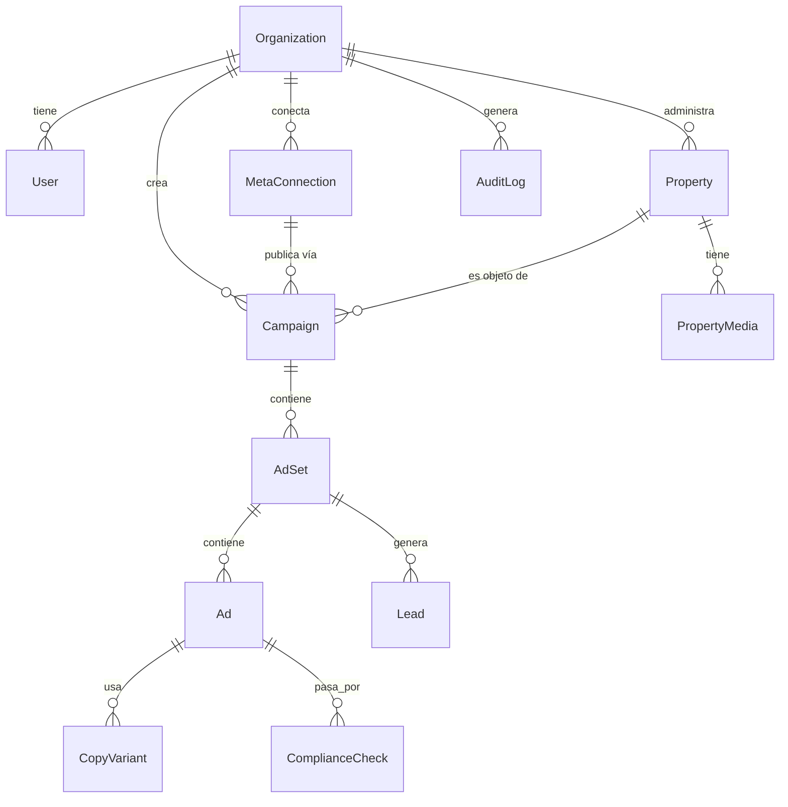

# Modelo de datos inicial — App de Gestión de Campañas Meta Ads para Inmobiliarias

**Módulo:** M0 — Descubrimiento y arquitectura técnica
**Estado:** Propuesta para revisión de Paul
**Versión:** 1.0 — 11 de agosto de 2026

Este documento describe las entidades principales y sus relaciones. Es la base conceptual sobre la que luego se escribirá el esquema real (Prisma/SQL) al iniciar el desarrollo de M1. Todas las entidades salvo `AgencyAdmin` incluyen `organization_id` para el aislamiento multi-tenant descrito en `ARQUITECTURA.md`.

## 1. Diagrama de entidades (resumen)

## 2. Entidades

### Organization (empresa inmobiliaria / tenant)
Representa a cada inmobiliaria cliente de la plataforma.
- `id`, `name`, `rut` (identificador tributario chileno, opcional), `created_at`, `status` (activa/suspendida).

### User (usuario interno del aplicativo)
Personas que usan el aplicativo, ligadas a una `Organization` (o marcadas como usuario de agencia si administran varias).
- `id`, `organization_id` (nullable si es usuario de agencia), `email`, `role` (admin_agencia, admin_inmobiliaria, editor, solo_lectura), `created_at`, `last_login_at`.

### MetaConnection (cuenta de Meta conectada)
Guarda la vinculación OAuth de una `Organization` con su Business Manager de Meta (M1).
- `id`, `organization_id`, `meta_business_id`, `ad_account_id`, `page_id`, `whatsapp_business_account_id` (opcional), `instagram_actor_id` (opcional), `access_token_encrypted`, `token_type` (system_user / user), `status` (activa / expirada / revocada), `connected_at`, `connected_by_user_id`.

### Property (ficha de propiedad — M4)
Catálogo interno de propiedades de cada inmobiliaria; fuente de datos para campañas, creativos y copys.
- `id`, `organization_id`, `title`, `property_type` (casa, departamento, oficina, terreno...), `operation` (venta/arriendo), `address`, `comuna`, `region`, `price`, `currency` (CLP/UF), `surface_m2`, `bedrooms`, `bathrooms`, `description`, `status` (disponible, reservada, vendida/arrendada), `agent_contact_id`, `created_at`, `updated_at`.

### PropertyMedia (fotos/videos de una propiedad)
- `id`, `property_id`, `type` (imagen/video), `url` (en almacenamiento S3/R2), `width`, `height`, `order`.

### Campaign (mapea al objeto Campaign de Meta — M3)
- `id`, `organization_id`, `meta_connection_id`, `property_id` (opcional, una campaña puede promocionar varias propiedades), `name`, `objective` (tráfico, leads, ventas...), `campaign_type` (landing, sitio_web, formulario_instantaneo, whatsapp, instagram_messenger — M5), `budget_type` (diario/total), `budget_amount`, `status` (borrador, en_revision, activa, pausada, rechazada, finalizada), `meta_campaign_id` (una vez publicada), `created_by_user_id`, `created_at`.

### AdSet (conjunto de anuncios — mapea a Meta Ad Set)
Contiene la configuración de segmentación y presupuesto a nivel de conjunto.
- `id`, `campaign_id`, `name`, `targeting_mode` (manual/automático — M6), `targeting_json` (ubicación, edad, género, intereses, o config de Advantage+), `special_ad_category_active` (booleano — true solo si el targeting incluye EE. UU./Canadá/Europa), `destination_type` (WEBSITE, WHATSAPP, MESSENGER, INSTAGRAM_DIRECT, ON_AD), `meta_adset_id`, `status`.

### Ad / AdCreative (anuncio individual)
- `id`, `adset_id`, `creative_media_id` (referencia a `PropertyMedia` o creativo subido aparte), `active_copy_variant_id`, `meta_ad_id`, `status`, `rejection_reason` (si Meta lo rechaza).

### CopyVariant (copys generados por IA — M7)
Cada variante generada para pruebas A/B o iteración manual.
- `id`, `ad_id` (o `campaign_id` si aún no está asignado a un ad específico), `primary_text`, `headline`, `description`, `generated_by` ("ia" / "manual"), `prompt_version`, `approved` (booleano), `created_at`.

### ComplianceCheck (resultado de validaciones pre-publicación — M9)
- `id`, `campaign_id` o `ad_id`, `check_type` (ad_standards, special_ad_category, ley_consumidor, ley_datos_personales), `passed` (booleano), `details`, `checked_at`.

### Lead (contacto generado por una campaña)
Captura leads desde formulario instantáneo, landing (vía Pixel/CAPI) o inicio de conversación en WhatsApp.
- `id`, `organization_id`, `adset_id`, `property_id`, `source` (instant_form, website, whatsapp, instagram), `contact_name`, `contact_phone`, `contact_email`, `consent_data_processing` (booleano — Ley 21.719), `created_at`.

### AuditLog (bitácora de auditoría)
Registra acciones relevantes: conexión/desconexión de cuentas, publicación de campañas, cambios de rol, accesos de agencia a datos de una inmobiliaria.
- `id`, `organization_id`, `actor_user_id`, `action`, `entity_type`, `entity_id`, `metadata_json`, `created_at`.

## 3. Notas de diseño

- `targeting_json` se guarda como JSON flexible porque el campo `targeting` de la Marketing API de Meta es en sí mismo un objeto complejo y cambiante; se documenta su forma pero no se fuerza a un esquema relacional rígido.
- `special_ad_category_active` a nivel de `AdSet` (no de `Campaign` completa) porque, según la corrección de alcance geográfico, una misma organización podría en el futuro correr campañas normales para Chile y una campaña puntual dirigida a público en el extranjero (EE. UU./Canadá/Europa) que sí necesite las restricciones.
- `ComplianceCheck` queda como tabla separada (no solo un booleano en `Campaign`) para tener trazabilidad de qué se validó y cuándo, útil ante una fiscalización o un reclamo de un cliente.
- Este modelo es la base conceptual; al iniciar el desarrollo se traduce a un esquema Prisma real con tipos, índices (especialmente sobre `organization_id` y claves foráneas) y las políticas de Row-Level Security descritas en `ARQUITECTURA.md`.
